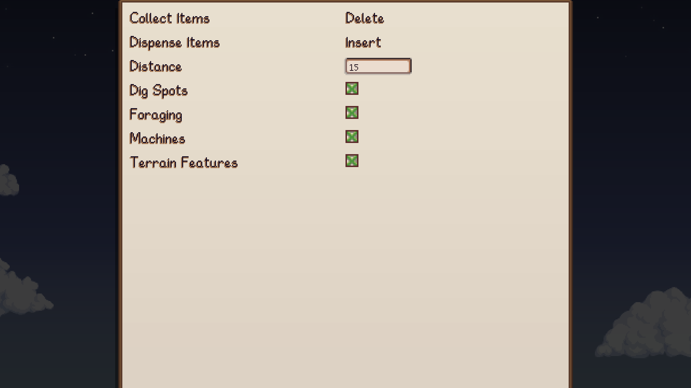

# Easy Access

Provides easier access to machines and producers in the game.

## Table of Contents

- [Easy Access](#easy-access)
  - [Table of Contents](#table-of-contents)
  - [Configurations](#configurations)
  - [Features](#features)
  - [Translations](#translations)

## Configurations

For ease of use, it is recommended to set config options
from [Generic Mod Config Menu](https://www.nexusmods.com/stardewvalley/mods/5098).

## Features

Collect items from machines.

Fill machines with items.

## Translations

❌️ = Not Translated, ❔ = Incomplete, ✔️ = Complete

|            |         Easy Access          |
| :--------- | :---------------------------: |
| Chinese    | [❌️](EasyAccess/i18n/zh.json) |
| French     | [❔](EasyAccess/i18n/fr.json) |
| German     | [❌️](EasyAccess/i18n/de.json) |
| Hungarian  | [❌️](EasyAccess/i18n/hu.json) |
| Italian    | [❌️](EasyAccess/i18n/it.json) |
| Japanese   | [❌️](EasyAccess/i18n/ja.json) |
| Korean     | [❔](EasyAccess/i18n/ko.json) |
| Portuguese | [❌️](EasyAccess/i18n/pt.json) |
| Russian    | [❌️](EasyAccess/i18n/ru.json) |
| Spanish    | [❌️](EasyAccess/i18n/es.json) |
| Turkish    | [❌️](EasyAccess/i18n/tr.json) |